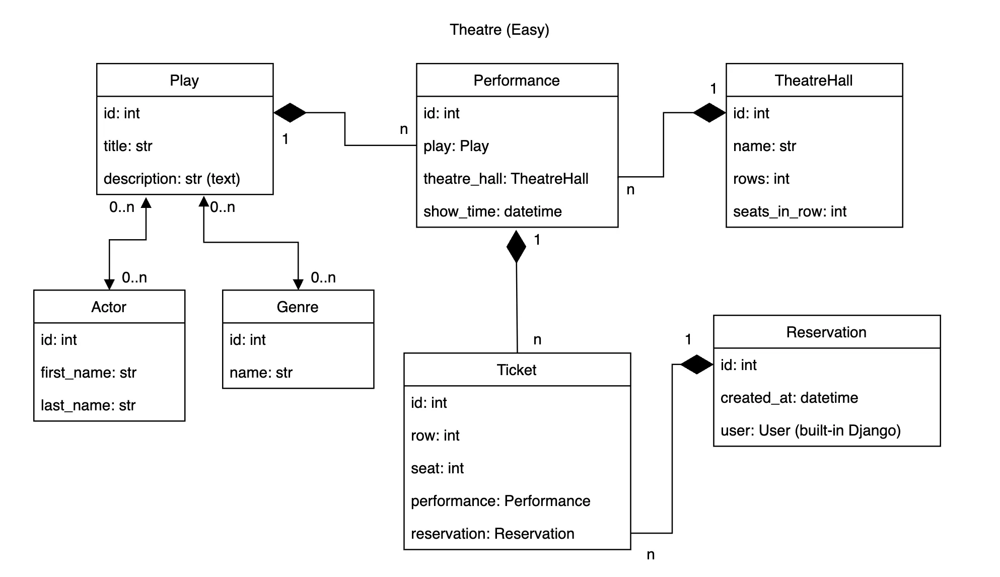
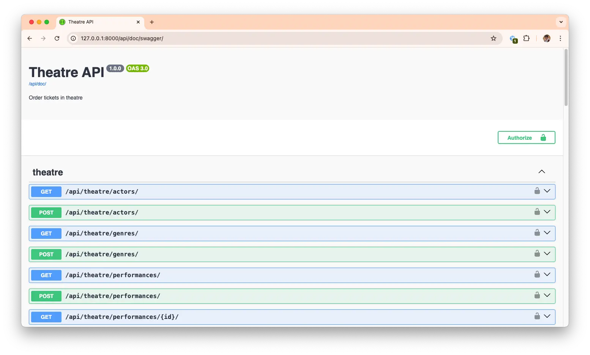
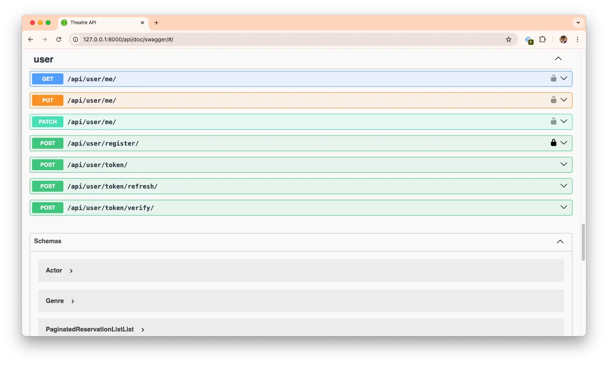

# Theatre API

API service for theatre management written in DRF


## Run with docker

Docker should be installed

```shell
docker-compose build
docker-compose up
```

## Demo

Test credentials (auto-created superuser):
* Username: admin@example.com
* Password: adminpassword


## Features

* JWT authenticated
* Admin panel /admin/
* Documentation is located at /api/doc/swagger/
* Managing reservations and tickets
* Creating plays with genres, actors
* Creating theatre halls
* Adding performances
* Filtering plays and performances

## Theatre Database Structure



## Theatre Swagger Documentation



